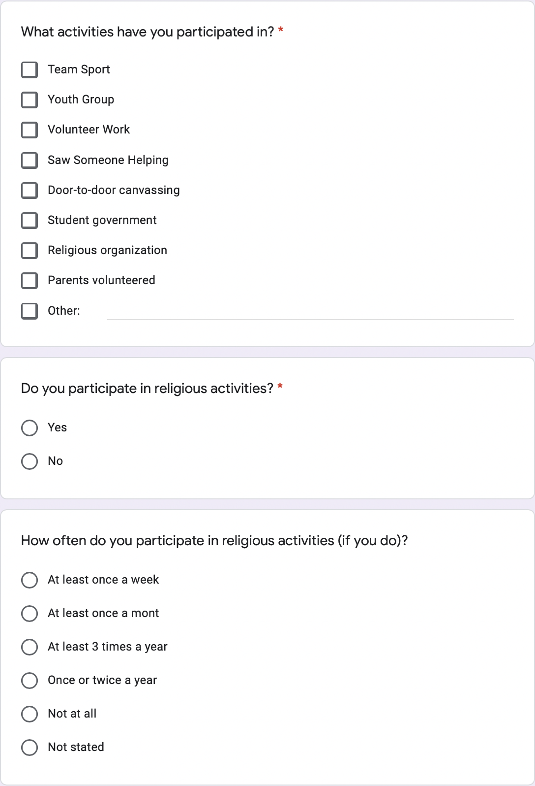

```{r setup, include=FALSE}
knitr::opts_chunk$set(echo = TRUE)

library(tidyverse)
# library(palmerpenguins)
```

```{r data_setup, include=FALSE}
gss_gvp <- read_csv("../../outputs/data/gss_gvp.csv")
```

# Introduction

The volunteering landscape in Canada has been changing over the years, especially since the pandemic. With COVID-19 spreading among the population and stay-at-home orders issued by the government to keep people safe, volunteering seems to be harder during the pandemic. Even though people are still trying to find ways to volunteer amidst one of the largest, health, economic, and social challenges throughout history, it is more difficult when most people are prone to staying at home. However, volunteering before the pandemic seems to be a different story than volunteering during the pandemic. In 2018, there are approximately 12.7 million people in Canada participated in some sort of formal volunteering activities and Statistics Canada estimated a total number of 1.7 billion hours people dedicated to volunteering in their own communities, non-profits, and charities (Plessis et al., 2020).

This paper uses the study of the 2018 General Social Survey (GSS) on Giving, Volunteering, and Participating (GVP) to investigate the giving, volunteering, and participating landscape in Canada in 2018. We want to look for some insights into people's GVP behavior before the pandemic. The 2018 GSS GVP provides a holistic insight for people to learn about the contribution people have given in Canada. Although the data and the analysis in this paper are before the COVID-19 pandemic, it does provide us with good insights into the challenges and opportunities of GVP in our current time.

The two main goals of the Canada General Social Survey are: \newline
1) Gain insights into the living conditions and well-being of Canadians by gathering data on social trends over time; and \newline
2) Provide support for specific social policy issues of interest.

The 2018 Canada General Social Survey on Giving, Volunteering, and Participating was conducted between September to December 2018. The survey interviewed people who are 15 years and over. The individuals came from 10 provinces (excluding the 3 territories) in Canada. There are two components of the Canada GSS Giving, Volunteering, and Participating (GVP) are core and classification content. The core content contains data that measures the living conditions and well-being of Canadians and provides information for specific social policy issues that are of interest. The classification content contains the respondents' demographic information such as age, gender, education, and income. Combining these two components, the Canada GSS Giving, Volunteering, and Participating aims to provide insights to the charitable and voluntary sector to make informative decisions.

This paper dived into the survey-methodology of the GSS GVP survey to learn about the population, sample, and frame. Then, we take a look into the Strengths in \@ref(strengths) of the methodologies performed by the survey. The Results in \@ref(results) section and Discussion in \@ref(discussion) section follow to gain a more thorough understanding of the GVP landscape. Finally, we talk about the ethics and bias in section \@ref(ethics-and-bias) in the survey and some possible next steps in section \@ref(next-steps) to address those issues. Through the investigation conducted by this paper, we found that most people gave and volunteered because they were personally affected in the in section \@ref(the-decision-of-giving-or-not-giving-is-most-affect-by-personal-reasons). In terms of participation, most people participated in a team sport in their youth and there weren't many people who participated in religious or spiritual activities. On the other hand, we identified some bias in the survey. Those biases include sampling bias (some populations are under-represented) and also potential self-serving bias (people might not truthfully answer the questions). We also proposed some solutions to augment the survey options to make the survey more inclusive to people with diverse backgrounds. It is important to do this analysis because it serves as a good comparison to the GVP landscape during or after the COVID-19 pandemic.

# Data

In this paper, we use R, a Statistical Computing Language, to analyze this dataset [@citeR]. We use tidyverse for data manipulation [@citeTidyverse]. We use [@citeJanitor] to clean dirty data. Graphs are made with ggplot2 [@citeGgplot2].

The dataset can be divided into 4 parts: demographic information, giving questions, volunteering questions, and participating questions. The demographic section asks respondents of the age, marital status, province of residence, and so on. For the three GVP sections, the survey asks respondents of the activities they took in GVP as well as the reasons of why they do something, not do something, or not do something more. Since this survey is created by the government in the attempt to take a census of Canadian population, there is no similar survey on par of the details of this survey. Most data cleaning or the variables that we created for the analysis are either to convert values of the variable to specific categories in words or to combine some variables that can be viewed in one column. We have also created bar plots for each of the variable used in this paper in section \@ref(graphs). A summary statistics table of the variables we used for this paper can be viewed in the Summary Statistics section in section \@ref(summary-statistics).

## Survey Overview

The content of the 2018 GSS GVP Questionnaire contains the following sections: (1) Getting Started - This section introduces the survey, selects a respondent, and collects key demographic information. For example, the information collected in this section includes age, marital standards, sex, and gender. (2) Relationship to the selected respondent - This section collects the relationship of each person in the household to the respondent. If there's only one person in the household, this section will be ignored. (3) Volunteering - For those who volunteer, this section collects information about the name and types of organizations they volunteered in, how often do they volunteer, and the duration of their volunteering work. For those who don't volunteer, this section asks about their history of volunteering and why they don't volunteer. (4) Giving - Similar to volunteering, the people who do give will answer questions about their decisions of giving and their reasons for giving. (5) Participating - In this section, respondents are asked about their Youth Experience of participating in activities such as organized team sport, volunteer work, and student government.
 
## Survey Methodology

### Population, Sample, Frame

The target population included all people who are older than 15 years old in Canada, excluding the residents of the Northwest Territories, Nunavut, and Yukon and full-time residents of institutions. The target sample size for the 2018 GVP was 20,000. The actual number of respondents was 16,149. For each province, minimum sample sizes were determined to ensure that each stratum has acceptable sampling variability. Once this requirement has been met, the remaining survey was distributed in a way that balanced the precision for both national-level and stratum-level. The frame of the GVP includes a sub-sample of respondents to Statistics Canada’s Labour Force Survey (LFS), groupings of telephone numbers linked to the same address and are available to Statistics Canada from various sources, and the Address Registrar (AR). The AR is used to group multiple telephone numbers that are linked to the same address.

### Sampling Strategy

To attain the sample, each of the ten provinces was divided into strata by their geographic areas. There are a number of the Census Metropolitan Areas (CMAs) were considered as separate strata such as Toronto, Hamilton, Montreal, and Vancouver. There are ten more strata formed by the non-CMA areas of the ten provinces. There are 27 total strata. Each record was in a stratum that is in its province. Simple random sample without replacement was used to select the next one in the stratum. The frame for GSS was created using several sources such as Census of Population, administrative data files, and billing files. Even with the current sampling strategy, the coverage of the population did improve from the previous years. Households without telephones were excluded from the survey population. For the eligible households, each of them needs to include at least one person who was older than 15 years old to be eligible for the survey. Then, one person would be chosen randomly from the household to participate in the survey either by completing an electronic questionnaire or to respond to a telephone interview.

Furthermore, since there are potential difficulties in reaching the volunteers who might want to participate in the survey, the survey used an approach called "rejective sampling" to sample the population. Rejective sampling is similar to sub-sampling. Instead of sub-sampling a portion of the population, it is interpreted as "rejecting" a portion of the population. By "rejecting" a portion of the population and focusing on the portion of the population that is not "rejected", it enabled more attention to call and focus on the population that might fulfill the survey.

### Strengths

The survey made a good effort to reduce systematic error by taking good measures on the interviewers and the process of gathering data. Errors that are not related to sampling errors can occur at every stage of the survey. Interviewers might have a slight bias against the respondents and they might misunderstand the instructions. Respondents might misunderstand the questions and made mistakes when answering the questions. Hence, the estimates from our sample might differ from the actual number if a complete census has been done. Some measures that are taken include 1) having highly skilled interviewers by giving them extensive training. 2) monitor the conversations between the interviewers and the respondents to detect any problems of the questionnaire design or easily misunderstood part. 3) impose off-screen help text, including examples that are relevant to help respondents understand the questions.

Non-response error is one of the biggest non-sampling errors when conducting this survey. Imputation has been carried out to cover those non-response errors. Non-response errors can arise when the respondents was not able to provide the information, refuse to provide the information, the interviewer was not able to reach the respondent, and so on. Imputation is done to provide a complete record of the instance so that the sample can be kept. A nine-step imputation was done to fill in partial or missing data. The holistic and careful imputation allows the survey to keep more data.


# Results

The paper did an overview of the Giving, Volunteering, and Participating landscape in Canada in 2018. It provides an analysis to serve as a comparison to the GVP landscape in Canada during the COVID-19 pandemic. The largest age group who took the survey are 65 years and older as shown in figure \@ref(fig:age). Most respondents are female and have a household size of 1 or 2 as shown in figure \@ref(fig:household-size). The number of respondents from each province is roughly similar to the ratio of the population of each province which makes the sample representative of the population from a number of people from each province's perspective. The majority of the focus of this paper is on Giving and Volunteering. For both Giving and Volunteering, most people who gave and volunteered because they were personally affected by their giving and volunteering as shown in figure \@ref(fig:volunteer-experience). This might sound selfish to start with but more investigation can be done to see how people are personally affected by their giving and volunteering. Furthermore, out of all the activities in giving, volunteering, and participating, religious reasons are the least among the options listed in the questions. This is also interesting since 68% of the population in Canada is religious (Cornelissen, 2021). More details will be discussed in the Discussion section. This result section serves as a high-level overview of the most significant insights and results from our data analysis.

# Discussion

## A Peak into the Demographics and GVP Landscape in 2018

This paper mainly focuses on the Giving, Volunteering, and Participating landscape in 2018. By gaining an overview of the GVP landscape in 2018, the paper serves as a point of reference when comparing it to the GVP landscape during the COVID-19 pandemic. Since people tend to stay at home more and avoid physical contact with people from other households as much as possible, the GVP landscape during the COVID-19 pandemic should offer a different insight than the one in 2018. From figure \@ref(fig:gender) and figure \@ref(fig:age), we can see that most respondents are female and most respondents are 65 years and older. A large portion of the respondents have received a post-secondary diploma and there is a small portion of people who have an education that is less than high school as shown in figure \@ref(fig:education). From \@ref(fig:household-size), we can see the household size bar plot skews to the left. It shows that most of the respondents either live by themselves or live with another person. From figure \@ref(fig:province), we can also see that most of the respondents were from Ontario. If we refer to the population in Canada by province, the ratio of the number of people in each province in the survey is roughly equal to the ratio of the actual number of people in each province. However, if we want to gain a better picture of the population in Canada, we should include respondents in the three territories as well. We will talk more about this in section \@ref(next-steps).

## The decision of Giving or Not Giving is most affect by personal reasons

In this subsection, we take a closer look into Canadians' Giving habits in 2018. We will focus on what kinds of giving activities Canadians do and the reasons why Canadians give or not give. From \@ref(fig:decision-of-giving), most Canadians decided to give because they have a tax credit. With the tax credit they have, they would be willing to give back to the world. The decisions to give are the least motivated by organizations that monitor. It is also interesting to see that there are organizations that monitor people's decision habits. From \@ref(fig:financial-giving), most Canadians give when they receive a mail of some kind. There is also a significant portion of Canadians gave on their initiatives. This result correlated to \@ref(fig:reason-of-giving) which we can see most Canadians gave because they are personally affected. The other reasons for giving are insignificant compared to the ones who are personally affected. On the other hand, the reason why Canadians do not give or do not give more is that they have already given back in some ways in the past as shown in figure \@ref(fig:reason-of-not-giving). The second largest reason is that there are too many organizations to choose from and it is difficult to decide which organization to give to. On top of that, some Canadians do not have the financial freedom to make a significant large donation. Since their donations might not be large, they might decide that their donations are not significant anyway and decide not to give. Charity fraud is also a legit concern for Canadians.

## Volunteering was also largely affect by personal reasons with fundraising being the most population volunteering activity

Among the people who volunteered in 2018, more people volunteered with their family members than volunteered with friends from figure \@ref(fig:volunteer-with). Among all the volunteer experiences listed as options in the survey, people engaged with fundraising the most as shown in \@ref(fig:volunteer-experience). Fundraising is the process of gathering either financial or non-financial resources to give to non-profit organizations (Corporativa). Other than fundraising, people also volunteered in teaching and mentoring. The least popular volunteer experience is volunteer driving and the protection of the environment. Similar to giving, most people volunteered because they were personally affected by some cause. These personally affected reasons can either be volunteering because their family volunteered as shown in \@ref(fig:reason-for-volunteering), but also they were personally affected by the volunteer activity. People also volunteered because they want to network and contribute to their communities. On the other hand, there are various reasons why people do not want to volunteer. Most people do not volunteer or do not volunteer more because no one asked them to or they do not have time to volunteer as shown in \@ref(fig:reason-for-not-volunteering). This shows us that if we urge people to volunteer more, this might be able to increase the volunteer activities in Canada. Also, some people think they might have already given enough of their time to volunteer. Others are not able to volunteer because of their health problems.

## Team Sport is the most widely attended Youth Activities

Participating is a relatively less focused part of the GSSP GVP survey compared to Giving and Volunteering. With the limiting number of questions and data the survey collection in this section, the paper focused on the youth experience and the frequency of religious activities. Team sport is the most participated youth activity among the options in the survey as shown in figure \@ref(fig:youth-experience). Indeed, Canada spent around 3.4 million dollars in 2019-2020 to promote team sport (Government of Canada, 2021). We can see how this can also be translated to 2018. The youth group is the second most participated youth activities. It is insightful to see most people in their youth decided to join some youth groups according to their interests. On the other, from figure \@ref(fig:religious-participation-services), religious organization and student government are the least participated youth activities among the options in the survey. In a school, the proportion of students who can participate in the student government is really small. Therefore, it is understandable that most people have never participated in student government in their youth.

## Weaknesses

Even though the target population of this survey includes all people who are 15 years old or older in the ten provinces of Canada. To gain a better and more comprehensive picture of the volunteering landscape in Canada, those who are less than 15 years old and those who are in the three territories should also be included. Including people in the three territories, will not only improves the inclusion of all people in Canada no matter their geological location, but also learn about the giving, volunteering, and participating behavior of the people who aren't well-studied in previous studies. On the other hand, people who are less than 15 years old also engaged in some sort of GVP, even though the number might be less. However, including them can provide us insights into how the younger generation engages in those activities and the analysis from their data can potentially provide a better education curriculum to them.

Since this survey asked several questions about the reasons why people are giving, volunteering, and participating, both the interviewers and the respondents can make mistakes when asking or answering the questions. Furthermore, the number of respondents in the sample of this survey is high, it is hard to have good control over standardizing every aspect when conducting the interviews. The study did make efforts to reduce these inconsistencies by quality assurance. Some quality assurance methods include the use of highly-skilled interviewers, extensive training of interviewers for the survey procedures and questionnaire, observation of interviewers to find problems. There might still be an error occurring systematically from both the interviewers and the respondents. Some of the ways to further reduce this systematic error can be: 1) assure anonymity for the interviewers or the respondents so that there is no potential bias towards either the interviewer or the respondents. 2) avoid revealing the purpose of the survey to prevent respondents to have suspicious thoughts about the target of the survey. 3) randomize response choice order so that there is further randomization.

## Ethics and Bias

One of the biases that might contain in this survey is sampling bias. Since the survey is distributed by either mail or by phone, for those people who live in distant areas or without the phone, they might not able to receive the survey and therefore under-represent in the survey. To reduce this bias, one potential solution is to pay more effort to reach those people who are under-represented because of the physical constraints we have mentioned above. Another bias we might have are self-serving bias. Since all the respondents self-reported their answers to the questions in the survey, people might answer questions in a way that made them sound more philanthropic or nicer. Others might pay less attention to the questions since there are a lot of questions in the survey and they might not answer the questions truthfully or accurately. 

Another thing that is worth pointing out is the population of the survey. Even though this survey is intended to gain insights into the giving, volunteering, and participation of the residents in Canada, the survey's demographic questions did not provide options to accommodate or represent the population. For instance, the survey did not provide an option for people who are under 15 years old. Obtaining data from those people can also provide insights into how to improve Canada's youth education. Moreover, the gender questions only have the "Male" or "Female" option. For people to represent their genders more comfortably, the survey should also include options such as "Non-binary", "Transgender", and "Intersex". They should also include "Prefer not to say" or "Others" to provide more flexibility for the respondents.

## Next Steps

One of the next steps we can do to represent the population better is to augment some of the options in the survey questions. This has been shown in the supplementary survey attached to this paper in the appendix section. As mentioned in the section \@ref(ethics-and-bias), we can add more options for gender such as "Non-binary", "Transgender", "Intersex", "Prefer not to say", or "Others" to give people more flexibility to express their gender in our survey. Also, there are other questions in the GSS GVP we did not include in this paper because of the scope of this paper. Some additional questions that we can include to understand the population better are questions about disabilities, how much people spent to do financial giving, and the number of time people dedicated to volunteering. This can give us a more holistic picture of the giving and volunteering of Canadian residents in 2018. Furthermore, we can also perform more analysis in a specific area if we want to learn more about the topic. For example, we mentioned religious activities in the section \@ref(team-sport-is-the-most-widely-attended-youth-activities). If one wants to learn more about GVP among the population that has a religion, one can extract questions and responses relevant to religion to learn more. In the supplementary survey section in section \@ref(supplementary-survey), we address some of the above mentioned issues from figure 16 to figure 26.
 
\newpage

\appendix

# Graphs
 
```{r age, echo=FALSE, fig.cap='Survey Respondents\' age'}
# Create bar plot for age group
ggplot(data=gss_gvp, aes(x=age_group, fill=age_group)) + 
  geom_bar(stat="count") +
  xlab('Age Group') +
  ylab('Number of Respondents') +
  theme(axis.text.x = element_text(angle = 45, hjust=1), legend.position = 'none')
```

```{r gender, echo=FALSE, fig.cap='Survey Respondents\' Gender'}
# Create bar plot for gender
ggplot(data=gss_gvp, aes(x=gender, fill=gender)) + 
  geom_bar(stat="count") +
  xlab('Gender') +
  ylab('Number of Respondents') +
  theme(axis.text.x = element_text(angle = 45, hjust=1), legend.position = 'none')
```

```{r education, echo=FALSE, fig.cap='Survey Respondents\' Education'}
# Create bar plot for education
ggplot(data=gss_gvp, aes(x=education, fill=education)) + 
  geom_bar(stat="count") +
  xlab('Education') +
  ylab('Number of Respondents') +
  theme(axis.text.x = element_text(angle = 45, hjust=1), legend.position = 'none')
```

```{r household-size, echo=FALSE, fig.cap='Survey Respondents\' Household Size'}
# Create bar plot for household size
ggplot(data=gss_gvp, aes(x=household_size, fill=factor(household_size))) + 
  geom_bar(stat="count") +
  xlab('Household Size') +
  ylab('Number of Respondents') +
  theme(legend.position = 'none')
```

```{r province, echo=FALSE, fig.cap='Survey Respondents\' Province of Residence'}
# Create bar plot for province of residence
ggplot(data=gss_gvp, aes(x=province, fill=province)) + 
  geom_bar(stat="count") +
  xlab('Province') +
  ylab('Number of Respondents') +
  theme(axis.text.x = element_text(angle = 45, hjust=1), legend.position = 'none')
```

```{r decision-of-giving, echo=FALSE, fig.cap='Decisions of Giving'}
# Create bar plot for decisions of giving
ggplot(data=gss_gvp[!is.na(gss_gvp$decision_of_giving),], aes(x=decision_of_giving, fill=decision_of_giving)) + 
  geom_bar(stat="count") +
  xlab('Decisions of Giving') +
  ylab('Number of Respondents') +
  theme(axis.text.x = element_text(angle = 45, hjust=1), legend.position = 'none')
```

```{r financial-giving, echo=FALSE, fig.cap='Financial Giving'}
# Create bar plot for financial giving
ggplot(data=gss_gvp[!is.na(gss_gvp$financial_giving),], aes(x=financial_giving, fill=financial_giving)) + 
  geom_bar(stat="count") +
  xlab('Financial Giving') +
  ylab('Number of Respondents') +
  theme(axis.text.x = element_text(angle = 55, hjust=1), legend.position = 'none')
```

```{r reason-of-giving, echo=FALSE, fig.cap='Reasons of Giving'}
# Create bar plot for reasons of giving
ggplot(data=gss_gvp[!is.na(gss_gvp$reason_of_giving),], aes(x=reason_of_giving, fill=reason_of_giving)) + 
  geom_bar(stat="count") +
  xlab('Reason of Giving') +
  ylab('Number of Respondents') +
  theme(axis.text.x = element_text(angle = 65, hjust=1), legend.position = 'none')
```

```{r reason-of-not-giving, echo=FALSE, fig.cap='Reasons of Not Giving'}
# Create bar plot for reasons of not giving
ggplot(data=gss_gvp[!is.na(gss_gvp$reason_of_not_giving),], aes(x=reason_of_not_giving, fill=reason_of_not_giving)) + 
  geom_bar(stat="count") +
  xlab('Reason of Not Giving') +
  ylab('Number of Respondents') +
  theme(axis.text.x = element_text(angle = 45, hjust=1), legend.position = 'none')
```

```{r volunteer-with, echo=FALSE, fig.cap='Volunteer with Family/Friends'}
# Create bar plot for volunteer with
ggplot(data=gss_gvp[!is.na(gss_gvp$volunteer_with),], aes(x=volunteer_with, fill=volunteer_with)) + 
  geom_bar(stat="count") +
  xlab('Volunteer With Family/Friends') +
  ylab('Number of Respondents') +
  theme(axis.text.x = element_text(angle = 45, hjust=1), legend.position = 'none')
```

```{r volunteer-experience, echo=FALSE, fig.cap='Volunteer Experience'}
# Create bar plot for volunteer experience
ggplot(data=gss_gvp[!is.na(gss_gvp$volunteer_experience),], aes(x=volunteer_experience, fill=volunteer_experience)) + 
  geom_bar(stat="count") +
  xlab('Volunteer Experience') +
  ylab('Number of Respondents') +
  theme(axis.text.x = element_text(angle = 45, hjust=1), legend.position = 'none')
```

```{r reason-for-volunteering, echo=FALSE, fig.cap='Reasons for Volunteering'}
# Create bar plot for reasons for volunteering
ggplot(data=gss_gvp[!is.na(gss_gvp$reason_for_volunteering),], aes(x=reason_for_volunteering, fill=reason_for_volunteering)) +
  geom_bar(stat="count") +
  xlab('Reasons for Volunteering') +
  ylab('Number of Respondents') +
  theme(axis.text.x = element_text(angle = 55, hjust=1), legend.position = 'none')
```

```{r reason-for-not-volunteering, echo=FALSE, fig.cap='Reasons for Not Volunteering'}
# Create bar plot for reasons for not volunteering
ggplot(data=gss_gvp[!is.na(gss_gvp$reason_for_not_volunteering),], aes(x=reason_for_not_volunteering, fill=reason_for_not_volunteering)) +
  geom_bar(stat="count") +
  xlab('Reasons for Not Volunteering') +
  ylab('Number of Respondents') +
  theme(axis.text.x = element_text(angle = 45, hjust=1), legend.position = 'none')
```

```{r youth-experience, echo=FALSE, fig.cap='Youth Experience'}
# Create bar plot for youth experience
ggplot(data=gss_gvp[!is.na(gss_gvp$youth_experience),], aes(x=youth_experience, fill=youth_experience)) + 
  geom_bar(stat="count") +
  xlab('Youth Experience') +
  ylab('Number of Respondents') +
  theme(axis.text.x = element_text(angle = 45, hjust=1), legend.position = 'none')
```

```{r religious-participation-services, echo=FALSE, fig.cap='Frequency of Religious Participation - Services'}
# Create bar plot for frequency of religious participation services
ggplot(data=gss_gvp, aes(x=religious_participation_services, fill=religious_participation_services)) + 
  geom_bar(stat="count") +
  xlab('Frequency') +
  ylab('Number of Respondents') +
  theme(axis.text.x = element_text(angle = 45, hjust=1), legend.position = 'none')
```


\newpage

# Appendix

## Supplementary Survey





\newpage

## Summary Statistics

```{r summary-statistics, echo=FALSE, fig.cap='Summary Statistics of the GSS GVP data in this paper'}
summary(gss_gvp)
```

# References

Plessis, V. du, Fournier-Savard, P., &amp; Hahmann, T. (2020, June 26). Volunteering in Canada: Challenges and opportunities during the COVID-19 pandemic. Retrieved March 20, 2022, from https://www150.statcan.gc.ca/n1/pub/45-28-0001/2020001/article/00037-eng.htm 

Corporativa, I. (n.d.). The power of fundraising for Social Development. Iberdrola. Retrieved March 20, 2022, from https://www.iberdrola.com/social-commitment/what-is-fundraising 

Gouvernement du Canada. (2021, April 6). Sport participation. Canada.ca. Retrieved March 20, 2022, from https://www.canada.ca/en/canadian-heritage/services/sport-participation.html 

Cornelissen, L. (2021, October 28). Religiosity in Canada and its evolution from 1985 to 2019. Retrieved March 20, 2022, from https://www150.statcan.gc.ca/n1/pub/75-006-x/2021001/article/00010-eng.htm 
